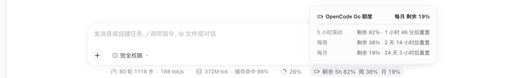

# dsh-opencode-usage

[](https://colorlessboy.github.io/dsh-opencode-usage/)
[](https://github.com/deepseek-ai/deepseek-harness)
[](https://github.com/topics/dsh-plugin)
[](LICENSE)

> **在额度见底之前，先看见它。**
> OpenCode Go 的 5 小时滚动 / 每周 / 每月剩余额度，化作 dsh Web 输入框统计行里最安静的
> 一枚 pill——一眼可见，细节点开才有。

**官网（中英文）**：<https://colorlessboy.github.io/dsh-opencode-usage/> ·
[DeepSeek Harness](https://github.com/deepseek-ai/deepseek-harness) 插件：在输入框下方的
开发者小字里、内置「上下文已用」pill 之后，多显示一枚 **OpenCode Go 额度** pill。



```
10 轮 89 步 · 42 tok/s  │  1.2M · 缓存命中 45%  │  24%  │  🔋 剩余 5h 80% │ 周 84% │ 月 42%
```

## 为什么选它

- **一眼可见** —— 三档剩余百分比常驻统计行，展开即详情；不藏在菜单里。
- **零配置** —— 自动跟随 `llm-pi-ai` 里已配好的 provider，不复制 key、不新增设置页。
- **零构建** —— 仓库自带可运行的 `lib/`，`dsh plugin add` 秒装即用。
- **零打扰** —— 不加悬浮窗、不接管路由；切到非 Go 模型自动隐身，不误报。
- **密钥不出 host** —— 浏览器只访问同源端点，API key 永不进入页面。
- **克制的同类** —— 不抢你的工作流，只补上你看不见的那一格电。

## 和同类插件的不同

dsh 的用量类插件很多，取舍差别主要在下面这几处：

| 常见同类做法 | 本插件 |
|---|---|
| 再造一个常驻悬浮卡 / 圆环 / 呼吸灯，占一块新位置 | 复用输入框已有的统计行，只多一枚 pill |
| 自带一套玻璃、渐变或霓虹皮肤 | 与内置「Token 用量」同一套面板 token 与皮肤 |
| 写死某个 key 引用名，或让你在面板里填 key / cookie | 跟随 `llm-pi-ai` 已配的 provider 与 `apiKeyEnv`，多账号 route 各自生效 |
| 显示「已用」，或给一个来路不明的孤立百分比 | 三档一律剩余量，chip / 面板 / 无障碍名称口径一致 |
| 接管 provider 路由、参与请求甚至计费 | 只读展示，不碰你的请求与账单 |
| 需要构建、构建授权或额外依赖 | 仓库自带 `lib/`，`dsh plugin add` 秒装即用 |

## 特性

- **按 provider 的 URL 判定** —— 只有当前选中模型所属 provider 的 `baseURL` 指向
  `https://opencode.ai/zen/go...` 时才显示；切到 DeepSeek 官方等其它 provider 时自动隐藏，
  不会误报错误。
- **只谈剩余量** —— 三档窗口（5 小时滚动 / 每周 / 每月）一律是**剩余**百分比：上游接口
  给的是已用百分比，host 半边在归一化时就算成剩余，wire 上不存在已用量，chip、详情面板、
  无障碍名称三处措辞一致。
- **点击展开详情** —— 与「会话统计」同一套面板皮肤，逐档列出剩余百分比与重置倒计时；
  标题给出最紧的那一档（例如 `每月 剩余 42%`），不会出现一个来路不明的孤立数字。
- **密钥不出 host** —— 浏览器只访问同源 `/api/opencode-usage`，API key 由 host 侧
  credentials 服务按 `apiKeyEnv` 解析，永不进入页面。
- **零构建依赖** —— `lib/` 是可直接加载的纯 JS 产物，装好即用，仓库不需要构建步骤。

## 数据来源

OpenCode Go 订阅的官方额度接口：

```
GET <baseURL>/usage          # https://opencode.ai/zen/go/v1/usage
Authorization: Bearer <apiKeyEnv 对应的凭据>
```

返回 `{"usage":{"rolling":{…},"weekly":{…},"monthly":{…}}}`，每个窗口带
`status` / `percent`（**已用**百分比）/ `resetsAt`。

## 安装

### 方式一：作为 bundle 安装（推荐）

```sh
dsh plugin --profile web add github:ColorlessBoy/dsh-opencode-usage
```

`package.json` 声明了 `dsh.bundle`，`dsh plugin` 会把它加进 profile 的
`dsh.profile.bundles` 并链接进 profile 的 `node_modules`。仓库自带可直接运行的 `lib/`，
安装过程不需要构建授权。

装好后**重启 `dsh web` 并刷新页面**。不启动也能先验证层已组合：

```sh
dsh --profile web --dump-config   # 应出现 "# == dsh-opencode-usage" 层
```

### 方式二：手工插一行（不进 bundles 列表）

在 `$DSH_HOME/profiles/web/cordis.patch.yml` 里按绝对路径挂载：

```yaml
- insert:
    - id: opencode-usage
      name: /absolute/path/to/dsh-opencode-usage/lib/index.js
```

**两种方式不要同时用**：同一个 `opencode-usage` id 出现两行是组合错误。

### 卸载

```sh
dsh plugin --profile web remove dsh-opencode-usage
```

手工方式则删掉那一块。之后重启 `dsh web`。

## 结构

```
dsh-opencode-usage/
├── package.json        # dsh.client 声明 lib/client.js 是浏览器半边；dsh.bundle 指向 patch
├── cordis.patch.yml    # bundle 层：插入 opencode-usage 这一行
├── lib/
│   ├── index.js        # host 半边：/api/opencode-usage 路由 + 上游抓取 + 缓存
│   └── client.js       # 浏览器半边：模块表 bundle，注册 composer dock 里的 chip
└── test/
    ├── host.test.mjs   # 路由行为：URL 判定、凭据、归一化、错误码、缓存、鉴权
    └── client.test.mjs # jsdom + 真实 React：chip、dock 同级排布、详情面板、中英文案
```

架构上分两半，是因为 API key 只在 host 侧：

| 半边 | 职责 |
|---|---|
| host `lib/index.js` | 解析 provider 的 `baseURL` / `apiKeyEnv`，带凭据请求上游，归一化为只含剩余量的 JSON，按 provider 缓存（成功 30s、失败 10s），对并发轮询合并为一次上游请求 |
| browser `lib/client.js` | 从会话的 `modelSelection` 投影读当前 provider，轮询同源端点（15s），把 chip 渲染成 dock 的独立 pill |

dock 把自己的内容用 `display: contents` 摊平，所以 chip 是 dock 的 flex item；它用
`flex order: 1` 排在内置「上下文已用」pill 之后（忽略 DOM 先后），与内置 pill 共用
同一行的居中、间距和基线。

它用的是**自己的 1px 竖线**分隔符，而不是内置 pill 的 `·` 字形：三个分段挤在一枚标签里，
竖线加两侧留白比借来的圆点更窄。图标是插件自带的 16px 线稿电池（电量意象），不依赖
`ui-primitives` 的图标名。皮肤其余部分（字号、行高、`--dsw-*` 语义 token、面板圆角与
阴影）与内置 pill 保持一致；详情面板底色用菜单色叠加不透明 surface token，整卡不透明，
不会透出背后的内容。

## 测试

两个脚本都从 DSH checkout 里解析 React / react-dom / jsdom，插件目录本身不需要
`npm install`：

```sh
DSH_CHECKOUT=/path/to/deepseek-harness npm test
```

`DSH_CHECKOUT` 省略时默认为本机的 DSH checkout 路径。`test/host.test.mjs` 只依赖 Node。

## 配置

无。行为完全由已有的 DSH 配置推导：

| 事实 | 来源 |
|---|---|
| 当前选中的 provider | 会话的 `modelSelection` 投影（`/model` 弹窗写入的同一个值） |
| provider 的 `baseURL` / `apiKeyEnv` | settings 服务投影的 `llm-pi-ai` 条目实时值：`settings.describe()` 的 `value.providers.<route>` |
| API key | credentials 服务解析 `apiKeyEnv` 指向的引用 |

未在 `llm-pi-ai` 中声明的 provider（例如 `deepseek-official` 由另一个适配器族提供）一律
视为「不适用」并隐藏。route 省略 `baseURL`、靠 pi-ai 内置目录继承端点时，投影里没有该
字段，同样按「不适用」处理。

## 开发提示

profile patch 是 live reload 的，**但 host 半边不会**：`lib/index.js` 由 Node 的 ESM 模块
缓存持有，改完必须重启 `dsh web`。浏览器半边（`lib/client.js`）由 client HMR 的文件监视器
热重载，改完刷新页面即可。

## License

MIT
